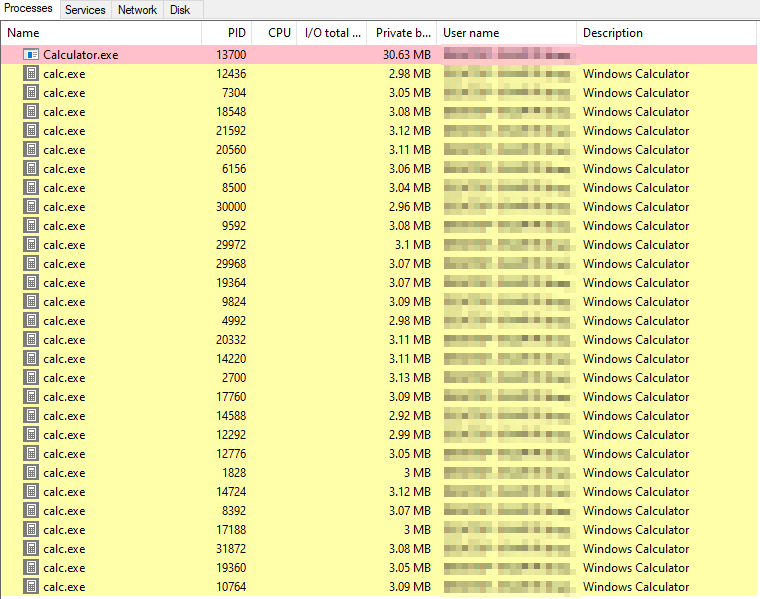

## APC Injection
Asynchronous Procedure Calls (APCs) are functions in a queue that threads must run. Threads run APCs once they enter an `alertable` state (when `SleepEx`, `SignalObjectAndWait`... are called). We must make sure we find a good target process (ex: explorer.exe) with a good amount of threads so that we can queue our payload into every single one, and eventually one might execute it.

If instead of just running our payload, we load a DLL, it will only get loaded once.

This process injection technique inserts our payload into a desired process, and queues it in every single thread of the target process as an APC.
It does so in the following manner:
1. The desired process is found in the system using the APIs from the `tlhelp32.h` header.
2. Memory is allocated in the process (`VirtualAllocEx`) and the payload is written to it (`WriteProcessMemory`).
3. All the threads running in the process are found using the `tlhelp32.h` header, and saved to a list.
4. Each thread is opened via `OpenThread` with `THREAD_SET_CONTEXT` access.
5. Finally, the payload is queued into each thread via `QueueUserAPC`.

Note: the payload in the code will spawn a calculator and promptly kill the process it was injected in.
Note x2: if you don't change this payload to something that stays alive (ex: some msfvenom reverse shell), it will spawn a myriad of calculators just like this.
